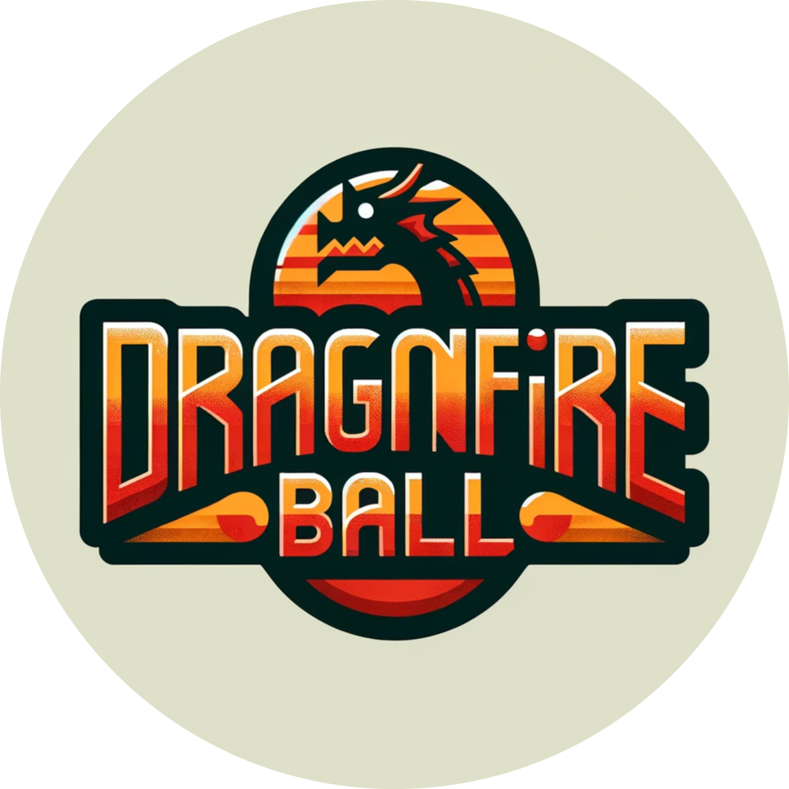

# DragonFire Ball Game Documentation

## Game Description
**DragonFire Ball** is an engaging 2D platformer game where the player navigates a dragon character through various levels filled with enemies and traps. The dragon exhibits a range of dynamic features such as movement, jumping, wall jump and slide, shooting, and a basic stat system to track its progress.

## Features
- **Movement**: Fluid and responsive control over the dragon's movement.
- **Jumping**: Ability to perform standard jumps.
- **Wall Jump and Slide**: Special mechanics to interact with walls, enabling the dragon to jump off them or slide down.
- **Shooting**: Dragons can shoot fireballs to defeat enemies.
- **Enemies and Traps**: Each level is populated with various enemies and traps to challenge the player.
- **Basic Stat System**: Tracks the player's stats like health and score.
- **Multiple Levels**: A variety of levels that increase in difficulty as the game progresses.

## Development Stack
- **Unity Hub (version 2022 LTS)**: The main platform for developing the game. [Access Unity Hub](https://unity.com/download)
- **WebGL**: Used to render the 2D template and for game deployment on web browsers.
- **C# (C Sharp)**: The programming language used for scripting the game behavior.
- **Microsoft Visual Studio**: The Integrated Development Environment (IDE) for writing and managing code. [Access Microsoft Visual Studio](https://code.visualstudio.com/download)

<!-- ## Access Links
If you don't have Unity and Visual Studio already installed
- Unity Hub: [Access Unity Hub](your-unity-hub-link)
- Microsoft Visual Studio: [Access Microsoft Visual Studio](your-visual-studio-link) -->

## Platforms
The game is built to support multiple platforms, including:
- Android
- WebGL
- iOS

## Project Structure
Below is the project structure outlining the various directories and their contents:

```
DragonFireBall/
├── Assets/
│   ├── Animation/
│   ├── Audio/
│   ├── Fonts/
│   ├── Levels/
│   ├── Prefabs/
│   ├── Scenes/
│   ├── Scripts/
│   └── Sprites/
├── Packages/
├── ProjectSettings/
├── Recordings/
├── UserSettings/
├── .gitignore
├── .vsconfig
└── README.md
```